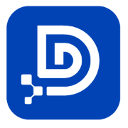

# DNDHUBS

> **Data & Digital Hubs — modular infrastructure, shared standards, and AI-powered product systems.**

DNDHUBS is building a layered software ecosystem for creating modern digital products with stronger architectural consistency across standards, developer tooling, integrations, automation, identity, analytics, and AI-assisted workflows.

Our focus is to make it easier to design once, build with reusable foundations, and deliver across multiple environments without losing structure as systems grow.

---

## What DNDHUBS Is About

DNDHUBS combines open-source foundations with extensible product architecture.

Across this organization, we are developing:

- **shared standards and contracts**
- **TypeScript-first foundational libraries**
- **portable utilities and helper systems**
- **adapters and integration layers**
- **AI-assisted engineering workflows**
- **analytics, orchestration, and automation infrastructure**
- **multi-surface delivery for apps, plugins, SDKs, and embeds**

The broader goal is to support community-to-enterprise software with reusable building blocks instead of one-off implementations.

---

## Core Ecosystem Direction

### DOMSpec
**DOMSpec** is one of the clearest public entry points into the DNDHUBS ecosystem. It represents our direction around structured specifications, consistent platform description, and architecture-led development.

➡️ **Start here:** [dndhubs/domspec](https://github.com/dndhubs/domspec)

### SynAI
AST-first UI and application composition for structured interface generation and delivery.

### Fluxr
Protocol-driven orchestration and integration systems for connecting technologies, providers, and runtime operations.

### Trakrr / Trakfox
Tracking, actions, rewards, and analytics-oriented product systems.

### GEOCoLab
Generative Engine Optimization workflows and tooling.

### MINTLock
Identity, access, authority, and secure token-driven interaction models.

### DataOrb
Unified multi-surface product access and orchestration experiences.

---

## What Makes This Ecosystem Different

### Standardization first
We care deeply about system-wide consistency, strong contracts, and reusable architecture.

### Layered by design
The ecosystem is organized into layers so contracts, pure libraries, helpers, adapters, engines, APIs, SDKs, applications, plugins, and embeds can evolve with clearer boundaries.

### Open foundations
Where possible, we publish reusable building blocks as open-source libraries that support the larger ecosystem.

### Built for the future of software delivery
We are designing for a world where human contributors and AI systems can both work from clear architectural sources of truth.

---

## Start Here

### For developers
- Explore our public foundational repositories
- Start with [DOMSpec](https://github.com/dndhubs/domspec)
- Review package-level READMEs, contribution guides, and security policies
- Follow the architecture and naming patterns used across the ecosystem

### For founders and product teams
- Explore how DNDHUBS approaches reusable infrastructure
- Follow the evolution of platforms like Fluxr, GEOCoLab, Trakrr, and DataOrb
- Watch for open libraries that can be adopted independently

### For contributors
We welcome contributors interested in:
- architecture
- standards
- TypeScript libraries
- developer tooling
- integrations
- documentation
- AI-assisted engineering systems

Please check each repository for its local contribution and security guidelines before contributing.

---

## Featured Public Direction

We are especially interested in advancing:

- ecosystem standards
- structured platform manifests
- modular library design
- developer experience
- AI-ready documentation and architecture
- reusable infrastructure for modern digital products

---

## Sponsors

Support from sponsors helps us build and maintain open-source foundations, shared standards, tooling, and ecosystem infrastructure across DNDHUBS.

➡️ **Become a sponsor:** [View sponsorship packages](./SPONSORSHIP.md)  
➡️ **Sponsor on GitHub:** [github.com/sponsors/dndhubs](https://github.com/sponsors/dndhubs)  
➡️ **Sponsor on Open Collective:** [https://opencollective.com/dndhub](https://opencollective.com/dndhub)

### Strategic Partners

  

### Platinum Sponsors

  

### Gold Sponsors

  

### Silver Sponsors

- [GEOCoLab](https://www.geocolab.com)
- [Trakfox](https://www.trakfox.com)
- [DataOrb](https://www.dataorb.co)

### Bronze Sponsors

- Jetro Olowole

### Supporters

- @jetro4u

## Community & Links

- **Website:** [dndhubs.com](https://dndhubs.com)
- **GitHub:** [github.com/dndhubs](https://github.com/dndhubs)
- **X / Twitter:** [@dndhubs](https://x.com/dndhubs)
- **LinkedIn:** [DNDHUBS](https://linkedin.com/company/dndhubs)

---

## A Note on the Vision

DNDHUBS stands for **Data & Digital Hubs**.

This organization exists to bring together standards, infrastructure, products, integrations, and AI-enabled workflows into one coherent architectural direction — with open foundations where they create the most long-term value.

  <em>Building reusable standards, modular infrastructure, and future-ready digital systems.</em>

